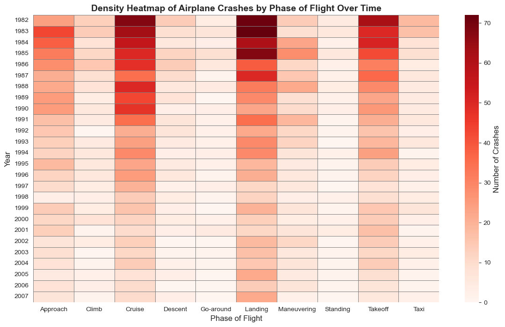

# ✈️ Airplane Risk Analysis for Business Expansion

This project examines aviation accident records to identify trends, assess aircraft safety, and evaluate risk factors. Using **The NTSB aviation accident database (1962-2023)**, the analysis aims to support a critical business decision: selecting aircraft with the lowest operational risk for business flights in the U.S. As the company expands into the aviation industry, it seeks to purchase and operate airplanes for commercial and private use but lacks insights into potential risks. This study provides actionable findings that will help the new aviation division determine which aircraft models offer the safest investment.

## 💼 Business Understanding

Aviation safety is a critical concern for airlines, manufacturers, and regulatory bodies. Understanding accident trends can help identify high-risk aircraft models, flight phases with elevated accident occurrences, and long-term safety trends. The insights from this analysis are valuable for:

- Airlines looking to improve fleet safety
- Regulatory bodies setting safety policies
- Investors evaluating aviation risks
- Manufacturers improving aircraft design

But what questions would this analysis help answer for the business?

- Which aircraft models have the highest number of uninjured passengers, and what does this indicate about safety?
- How do airplane crash occurrences vary by phase of flight over different periods, and what trends can be observed?
- What is the yearly trend of people involved in aviation accidents, and does it indicate an increase or decrease in overall aviation risk?
- How can these insights guide the business in making safer aviation investment decisions?

## 📊 Dataset

The analysis utilizes **The NTSB aviation accident database (1962-2023)**, which provides detailed records of airplane accidents. The dataset includes essential accident-related information such as:

- **Aircraft Model & Type**: Identifies which airplane models are most frequently involved in accidents.
- **Accident Dates & Locations**: Helps track historical trends and geographical risk factors.
- **Injury Severity & Passenger Outcomes**: Records the number of fatalities, serious injuries, minor injuries, and uninjured passengers.
- **Flight Phases**: Captures details on when accidents occurred during a flight.

This dataset serves as a reliable source for identifying aviation risk factors and informing strategic decisions.

## 📈 Key Visualizations

Below are three critical visualizations that provide insights into accident trends and risk factors:

#### 1️⃣ Understanding the Relationship Between Survivability and Operational Risk

#### 2️⃣ Exploring Crash Frequency by Phase of Flight Over Time

#### 3️⃣ Understanding the Relationship Between Injuries and Survivability over Time

## 📌 Conclusion
- **Airplane Make-Model Insights**: The **Piper PA-42-720, Piper PA-44-180, and Cessna 421** stand out as aircraft models with the highest number of uninjured individuals in recorded accidents. This suggests that these aircraft have a strong record of survivability, potentially due to superior build quality, operational use, and maintenance history. Further analysis of maintenance trends and operational environments is recommended to validate these safety indicators.
- **Phase of Flight Insights**: Accidents predominantly occur during takeoff, landing, and cruise, with takeoff and landing posing the highest risks. Factors such as mechanical failures, human error, and adverse weather contribute to incidents in these phases. While aviation accidents have declined over time, these critical phases still demand heightened safety measures, real-time monitoring, and strict operational protocols.
- **Injury Severity Insights**: A steady decline in accident frequency has led to fewer injuries and fatalities over the years. This reduction can be attributed to advancements in aviation technology, stricter regulations, improved pilot training, and enhanced maintenance practices. The industry must continue prioritizing comprehensive pilot training, stringent maintenance routines, and investment in modern safety innovations.

By leveraging these insights, aviation businesses can make informed decisions regarding fleet selection, operational risk management, and strategic safety improvements, ensuring long-term success in the industry.

## ⚙️ Technologies Used
- **Python** - `Pandas`, `Matplotlib`, `Seaborn`, `NumPy`, `TheFuzz`
- **Jupyter Notebook** 
## 📂 Repository Structure  
- `Cleaned/` → Folder containing the extracted cleaned datasets for interactive dashboard creation with Tableau    
- `Data/` → Folder containing datasets for analysis  
- `images/` → Folder containing key visualizations obtained from the analysis  
- `README.md` → This document outlining project details  
- `index.ipynb` → Jupyter Notebook containing the full analysis

